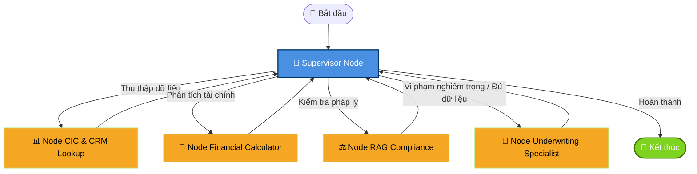

# 🏦 AI Banking Copilot - Trợ Lý Thẩm Định Tín Dụng Doanh Nghiệp (Multi-Agent System)

Hệ thống Trợ lý AI Banking Copilot & Thẩm định Tín dụng Doanh nghiệp Tự động được phát triển dựa trên kiến trúc **Supervisor Multi-Agent** sử dụng **LangGraph**, **LangChain**, **Google Gemini API** và **Streamlit**. 

Hệ thống giúp Quản lý Quan hệ Khách hàng (RM - Relationship Manager) và Chuyên viên Thẩm định Tín dụng ngân hàng tự động hóa quá trình tra cứu thông tin tín dụng, tính toán sức khỏe tài chính, rà soát tuân thủ quy định pháp lý (Thông tư 39/2016/TT-NHNN) và tự động lập **Tờ trình Thẩm định Tín dụng** chuẩn nghiệp vụ.

---

## 🌟 Tính Năng Nổi Bật

- **🤖 Đồ thị Multi-Agent linh hoạt (LangGraph Supervisor Architecture):** Điều phối thông minh luồng thẩm định qua 4 Chuyên gia Agent riêng biệt.
- **📊 Tra cứu Tín dụng & CRM (CIC Node):** Tự động tra cứu lịch sử dư nợ, phân nhóm nợ CIC, điểm tín dụng và số lần quá hạn từ CSDL Ngân hàng.
- **🧮 Động cơ Tính toán Tài chính Chính xác (Python Financial Engine):** Loại bỏ hoàn toàn rủi ro ảo giác (Hallucination) của AI bằng cách dùng Python thuần để tính các chỉ số $D/E$ (Nợ/VCSH) và $DSCR$ (Khả năng trả nợ).
- **⚖️ Rà soát Pháp lý & RAG (RAG Compliance Engine):** Quét mục đích vay với quy định điều cấm cho vay và cảnh báo kiểm soát theo **Thông tư 39/2016/TT-NHNN**.
- **📝 Tự động Lập Tờ trình Thẩm định (Underwriting Specialist Node):** Sử dụng Gemini 3.5 Flash / Flash Lite với Structured Output (Pydantic Schema) để sinh Tờ trình Thẩm định Tín dụng đầy đủ 4 phần chuẩn nghiệp vụ ngân hàng.
- **⚡ Giao diện Real-time Streaming UI (Streamlit):** Hỗ trợ hiển thị chữ nhảy (Token Streaming) từng thời điểm, mang lại trải nghiệm tương tác mượt mà cho cán bộ RM.

---

## 📐 Kiến Trúc Hệ Thống (Workflow Graph)

Mô hình điều phối luồng làm việc dạng Supervisor Workflow Graph:



---

## 📁 Cấu Trúc Thư Mục Project

```text
bank_agent/
├── app.py                      # Giao diện chính Streamlit Chatbot & Real-time Token Streaming
├── pyproject.toml              # Quản lý dependencies & cấu hình dự án bằng `uv`
├── Makefile                    # Các lệnh tiện ích cho dev (install, run, test, lint)
├── langgraph.json              # Cấu hình LangGraph Deployment
├── data/
│   ├── cic_crm_database.csv    # CSDL Giả lập thông tin CIC và CRM doanh nghiệp
│   └── banking_regulations.json # Tập dữ liệu quy định pháp lý Thông tư 39/NHNN
├── src/
│   ├── agent/
│   │   └── graph.py            # Khởi tạo & biên dịch Supervisor StateGraph
│   ├── nodes/
│   │   ├── supervisor_node.py              # Node Điều phối trung tâm & Routing Logic
│   │   ├── cic_csv_node.py                 # Node tra cứu lịch sử CIC/CRM từ CSV Service
│   │   ├── financial_calc_node.py          # Node tính toán hệ số D/E, DSCR bằng Python Engine
│   │   ├── rag_compliance_node.py          # Node kiểm tra tuân thủ pháp lý RAG Engine
│   │   └── underwriting_specialist_node.py # Node LLM Gemini lập Tờ trình Thẩm định
│   ├── schemas/
│   │   ├── underwriting_state.py           # TypedDict Định nghĩa State chung của Graph
│   │   ├── financial_schema.py             # Pydantic Schema cho kết quả phân tích tài chính
│   │   ├── legal_schema.py                 # Pydantic Schema cho kết quả tuân thủ pháp lý
│   │   └── underwriting_schema.py          # Pydantic Schema cho phán quyết & Tờ trình
│   └── services/
│       └── csv_banking_service.py          # Service kết nối và truy vấn dữ liệu CSV/DB
└── tests/
    ├── test_pipeline.py                    # Script chạy nhanh kiểm thử pipeline end-to-end
    └── test_demo_scenarios.py             # Script chạy 3 kịch bản demo mẫu
```

---

## 🛠️ Công Nghệ Sử Dụng

- **Python 3.13+** & **uv** (Package Manager cực nhanh).
- **LangGraph** (StateGraph Multi-Agent Orchestration).
- **LangChain Core & Community**.
- **Google Gemini API** (`langchain-google-genai` với Gemini 3.5 Flash/Lite).
- **Streamlit** (UI Framework tích hợp Streaming Messages).
- **Pydantic v2** (Data Validation & Structured Outputs).
- **Pandas** & **Pytest** (Data Manipulation & Automated Testing).

---

## 🚀 Hướng Dẫn Cài Đặt & Khởi Chạy

### 1. Yêu cầu môi trường
- Python >= 3.13
- Công cụ Quản lý gói `uv` (Khuyên dùng): [Cài đặt uv](https://docs.astral.sh/uv/)

### 2. Cài đặt dự án
```bash
# Clone repository
git clone https://github.com/nmd29io/AI-Agent.git
cd bank_agent

# Đồng bộ môi trường ảo và cài đặt thư viện
uv sync
```

### 3. Cấu hình Biến Môi Trường (.env)
Tạo file `.env` tại thư mục gốc của dự án và điền Gemini API Key:
```env
GEMINI_API_KEY=your_actual_gemini_api_key_here
```

---

## 💻 Hướng Dẫn Sử Dụng

### Khởi chạy Ứng dụng Web (Streamlit UI)
```bash
uv run streamlit run app.py
```
Sau đó truy cập trình duyệt tại địa chỉ: `http://localhost:8501`.

### Khởi chạy LangGraph Dev Server (Giao diện debug đồ thị)
```bash
uv run langgraph dev
```

### Chạy các Kịch bản Kiểm thử Tự động (Demo Scenarios)
```bash
# Chạy script 3 kịch bản demo thực tế
uv run python tests/test_demo_scenarios.py

# Chạy test pipeline đơn
uv run python tests/test_pipeline.py
```

---

## 🧪 3 Kịch Bản Demo Điển Hình

1. **Kịch bản 1: Hồ sơ Đủ điều kiện (Alpha Corp - MST: 0101234567)**
   - **Đặc điểm:** Nhóm nợ 1, D/E = 1.6 (đạt benchmark <= 2.5), DSCR = 1.5 (đạt benchmark >= 1.2), Mục đích vay bổ sung vốn lưu động mua nguyên vật liệu sản xuất hạt nhựa.
   - **Kết quả:** `ĐỒNG Ý CẤP TÍN DỤNG` với hạn mức đề xuất tối đa.
2. **Kịch bản 2: Hồ sơ Rủi ro Tài chính (Beta Corp - MST: 0207654321)**
   - **Đặc điểm:** D/E cao (3.8 > 2.5), DSCR yếu (0.95 < 1.2), dòng tiền yếu.
   - **Kết quả:** `CẦN BỔ SUNG HỒ SƠ` / Cảnh báo rủi ro đòn bẩy.
3. **Kịch bản 3: Hồ sơ Vi phạm Pháp lý Khẩn cấp (Gamma Corp - MST: 0309998887)**
   - **Đặc điểm:** Mục đích vay là đảo nợ / cơ cấu lại nợ ngân hàng khác -> Vi phạm Điều 8 Thông tư 39/2016/TT-NHNN.
   - **Kết quả:** Ngắt luồng sớm (Early Exit) -> `TỪ CHỐI CẤP TÍN DỤNG`.

---

## 📄 Giấy Phép & Tác Giả

- **Dự án:** Trợ lý AI Banking Copilot - Thẩm định Tín dụng Doanh nghiệp.
- **Bản quyền:** © 2026 AI Banking Project Team.
